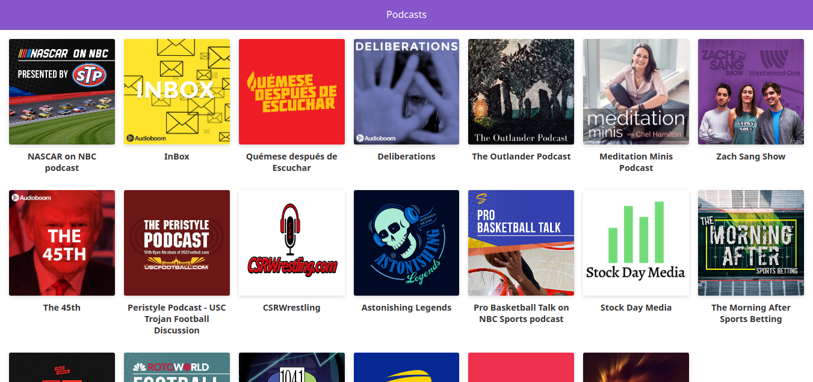

# App de Podcasts con Next.js

App de Podcasts integrada con la Api de AudioBoom para aprender Next.js

[Ver la aplicación](https://podcasts-nextjs.now.sh/)

## ¿Cómo funciona?

Requiere Node.JS 10

- `npm install` para instalar las dependencias.

- `npm run dev` para el entorno de desarrollo.

- `npm run build && npm start` para el entorno de producción.

## Licencia

MIT
